## 云医通医疗门诊系统

> 基于 Vue/Element UI 和 Spring Boot/Spring Cloud & Alibaba 前后端分离的分布式微服务架构

### 一、项目启动
#### 启动服务
1. `nacos`配置并启动
    ```properties
    db.url.0=jdbc:mysql://127.0.0.1:3306/yyt-config?characterEncoding=utf8&connectTimeout=10000&socketTimeout=30000&autoReconnect=true&useUnicode=true&useSSL=false&serverTimezone=UTC
    db.user=root
    db.password=123456
    ```
2. 启动`Redis`

#### 启动后端
- 运行模块
  - [yyt-auth](yyt-auth)、[yyt-gateway](yyt-gateway)
  - [yyt-system](yyt-modules%2Fyyt-system)、[yyt-os](yyt-modules%2Fyyt-os)

#### 启动前端
```shell
cd yyt-ui
npm run dev
```
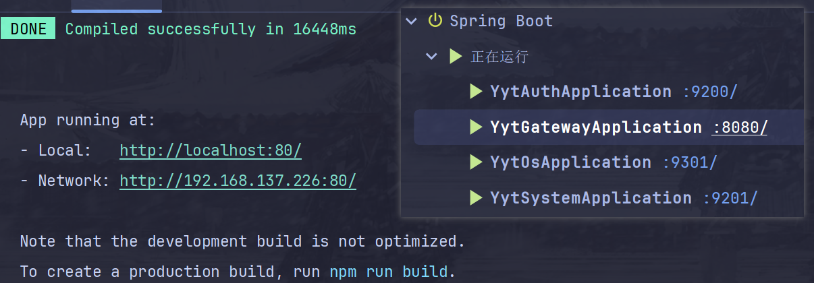

### 二、功能界面展示

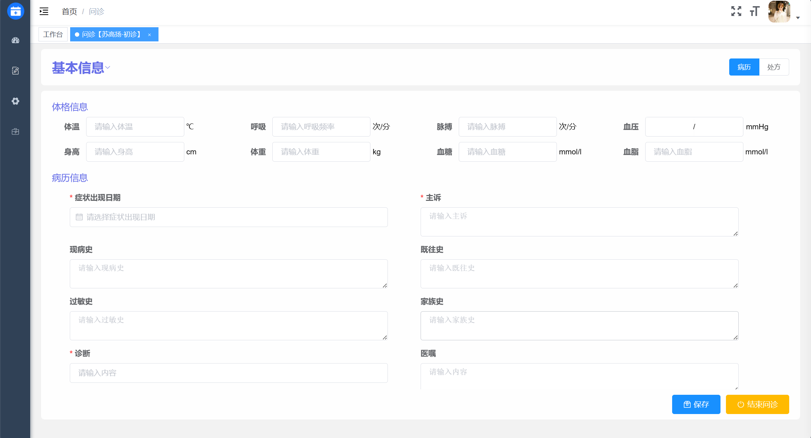
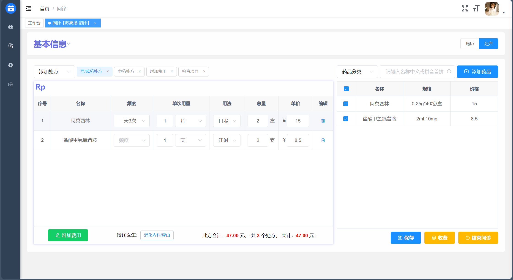
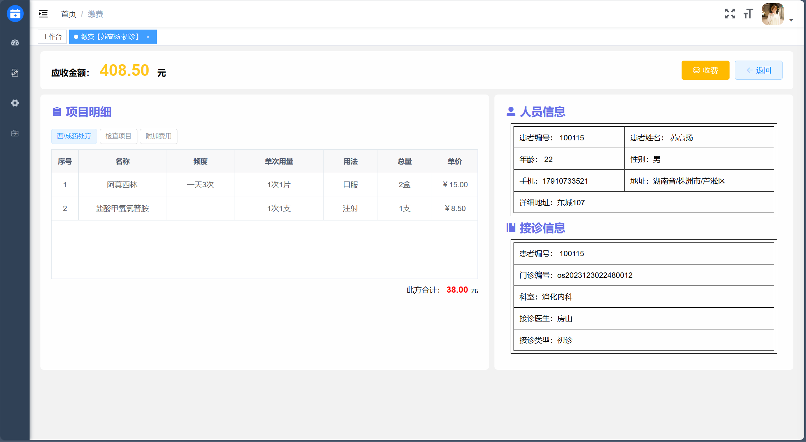

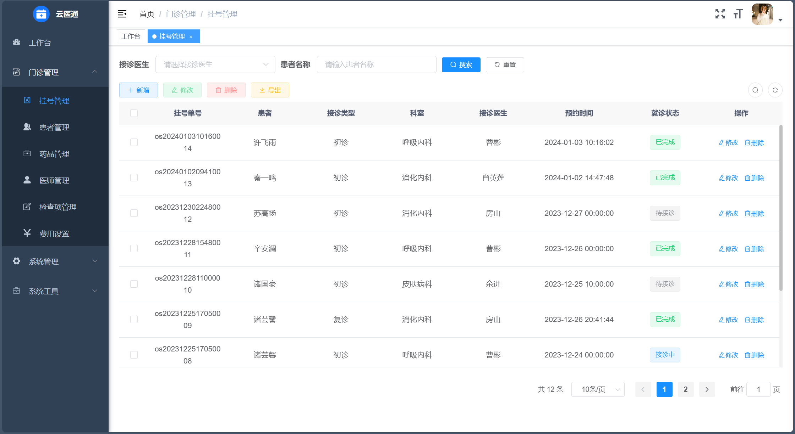
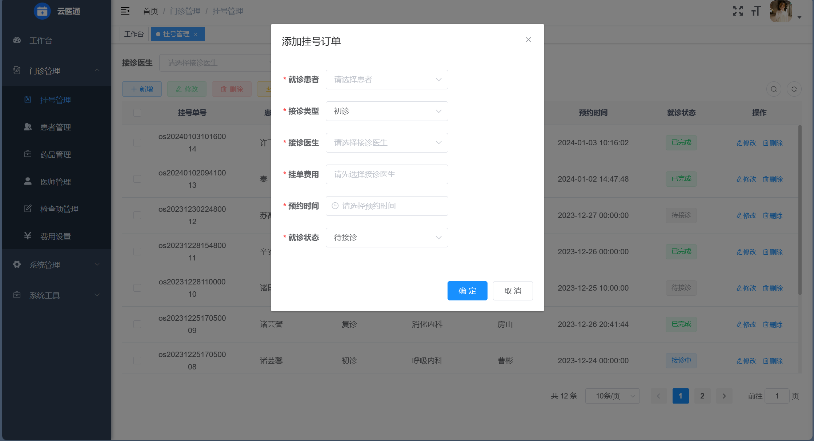
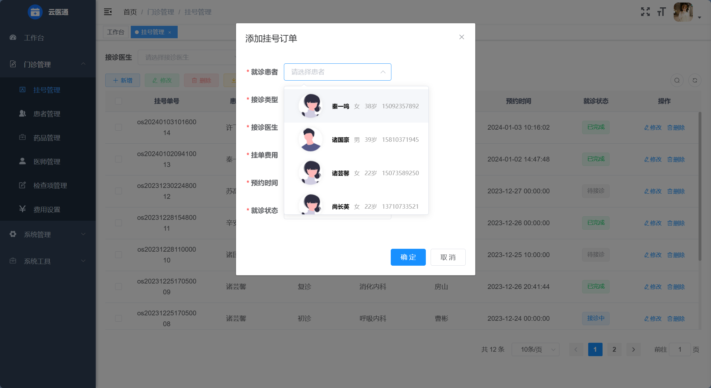

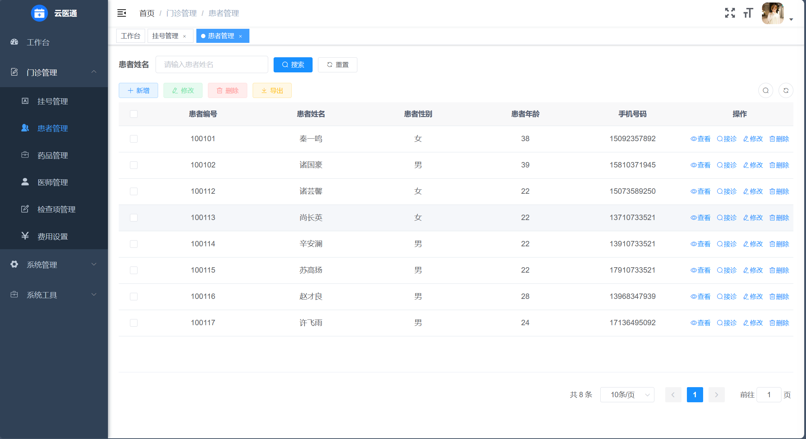
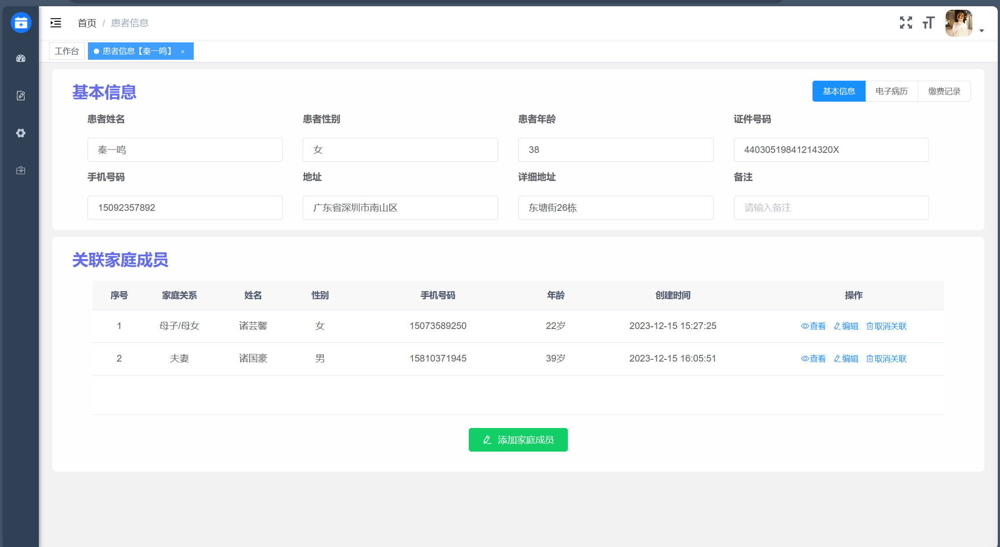
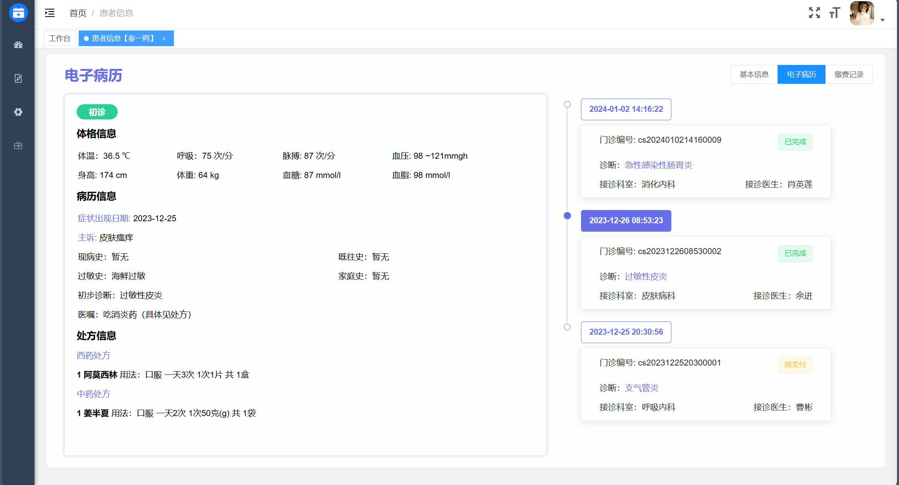
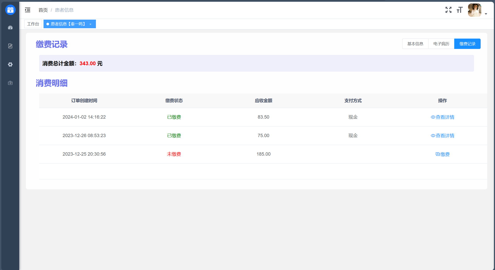

### 三、待改进
- 医生排班
  - 根据医生默认值班信息,生成预排班,确认后生成排班信息
  - 挂号时需要判断医生是否值班以及余号
- 完善支付模块
  - 缴费中心模块管理
  - 使用canvas生成处方详情图片(包含支付二维码)